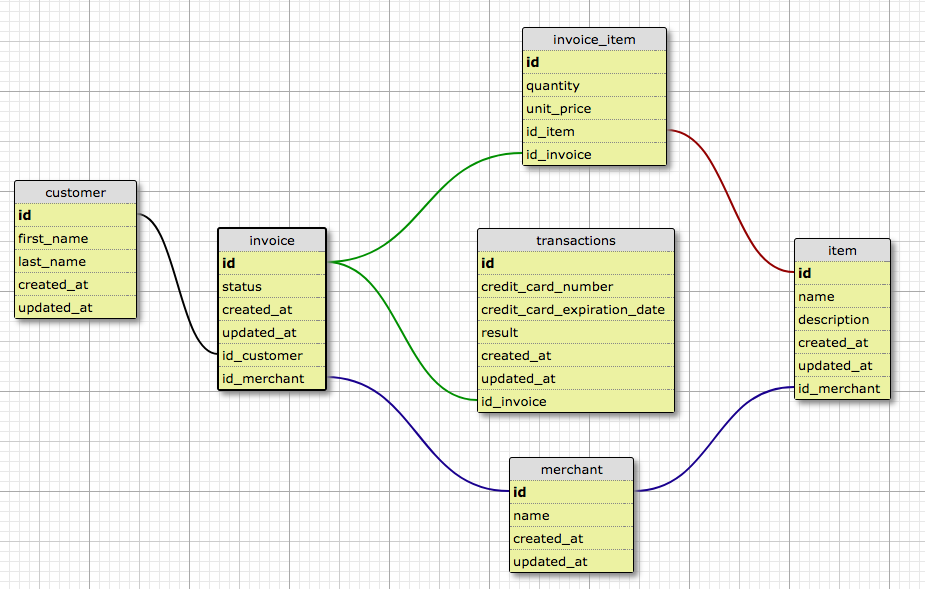

# Rails Engine

Rails Engine API is a an app built with Rails 5.1.4 and ActiveRecord to analyze sales data. This app uses sample Sales Engine data from [here](https://github.com/turingschool-examples/sales_engine/tree/master/data). Please note, this data is already included in this Repository. Endpoints return JSON objects for Merchants, Customers, Items, Invoices, Invoice Items and Transactions along with business intelligence analytics.

## Setup

1. Fork this repository and clone it down to your local machine.
```
git clone https://github.com/kelleyjenkins/rails_engine.git
```

2. Enter into the Rails Engine directory in your terminal by typing:
```
cd rails_engine
```

3. Once there type ```bundle install``` into your terminal to load gems.

4. At this point you need to set up the databases. In your terminal run:
```
rails db:create db:migrate
```

5. You are ready to import the data from the CSV files which are included in this repository (Please note, this could take a few minutes to load all of the data):
```
rake import_all
```

6. To check that your data was successfully loaded, enter into rails console in your terminal ```rails c``` and run the following commands:
```
Merchant.all
Customer.all
Invoice.all
Item.all
InvoiceItem.all
Transaction.all
```
With each of the above commands you should see an ActiveRecord relation that includes an array of objects.

## Schema


## Testing

This app is tested locally with RSpec. To run the test suite from your rails_engine directory:
```
rspec
```

1. For further testing please clone the Rales Engine Spec Harness [here](git clone https://github.com/turingschool/rales_engine_spec_harness.git). Be sure you clone this into the same directory that holds your Rails Engine project:
```
git clone https://github.com/turingschool/rales_engine_spec_harness.git
```

2. Enter into the Rails Engine Spec Harness directory:
```
cd rales_engine_spec_harness
```

3. Bundle to install gems
```
bundle
```

4. In order to run the spec harness successful you must have your Rails Engine server running at the same time. In a separate window in your terminal, cd into your rails engine project directory and run ```rails s``` to start the server.

5. Switching back to your spec harness terminal window, run the spec harness:
```
bundle exec rake test
```


## Developers
- [Kelley Jenkins](https://github.com/kelleyjenkins)
- [Gabriel Afflitto](https://github.com/GabrielAfflitto)

## Additional Information
The project was developed by the Turing School of Software and Design as a paired project for Module 3. More information can be found here: http://backend.turing.io/module3/projects/rails_engine
